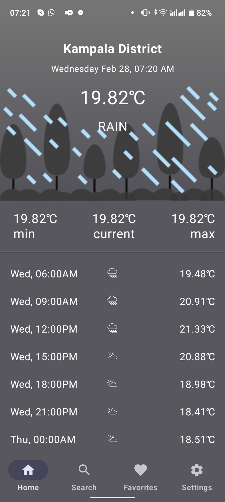
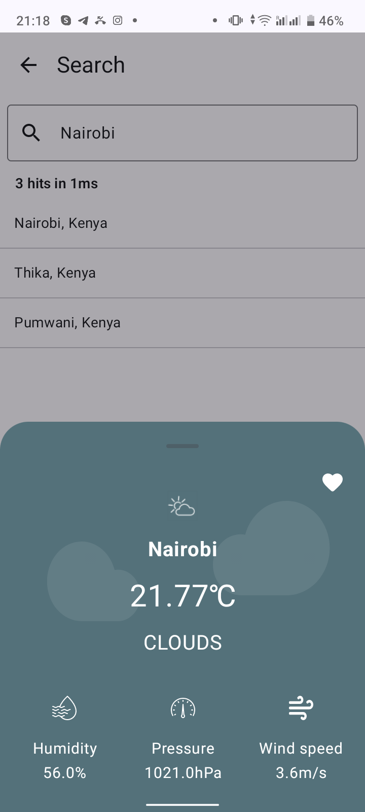

# DVT Weather :partly_sunny:

An Android weather application implemented using the MVVM pattern and clean architecture, Retrofit2, Dagger Hilt, Kotlin Flows, ViewModel, Coroutines, Room, Jetpack Compose, Kotlin DSL and some other libraries from the [Android Jetpack](https://developer.android.com/jetpack) . DVT Weather fetches data from the [OpenWeatherMap API](https://openweathermap.org/api) to provide real time weather information. It also makes use of the [Algolia Instant Search](https://www.algolia.com/products/instantsearch/) service which enables you search for weather conditions of various locations.

## Architecture
The architecture of this application relies and complies with the following points below:
* Pattern [Model-View-ViewModel](https://en.wikipedia.org/wiki/Model%E2%80%93view%E2%80%93viewmodel)(MVVM) which facilitates separation of different layers of the application.
* [Android architecture components](https://developer.android.com/topic/libraries/architecture/) which help to keep the application robust, testable, and maintainable.

<p align="center"><a></a></p>

## Technologies used:

* [Jetpack Compose](https://developer.android.com/jetpack/compose) - A modern toolkit for building native Android UI
* [Gradle Kotlin DSL](https://docs.gradle.org/current/userguide/kotlin_dsl.html) - An alternative syntax for writing Gradle build scripts using Kotlin. 
* [Version Catalogs](https://developer.android.com/build/migrate-to-catalogs) - A scalable way of maintaining dependencies and plugins in a multi-module project.
* [Retrofit](https://square.github.io/retrofit/) a REST Client for Android which makes it relatively easy to retrieve and upload JSON (or other structured data) via a REST based webservice.
* [Dagger Hilt](https://dagger.dev/hilt/) for dependency injection.
* [ViewModel](https://developer.android.com/topic/libraries/architecture/viewmodel) to store and manage UI-related data in a lifecycle conscious way.
* [StateFlow](https://developer.android.com/kotlin/flow/stateflow-and-sharedflow#:~:text=StateFlow%20is%20a%20state%2Dholder,property%20of%20the%20MutableStateFlow%20class) to enable flows to emit updated state and emit values to multiple consumers optimally.
* [Kotlin Flow](https://kotlinlang.org/docs/reference/coroutines/flow.html) to emit a stream of data with multiple values sequentially.
* [Navigation Component](https://developer.android.com/guide/navigation) to handle all navigations and also passing of data between destinations.
* [Timber](https://github.com/JakeWharton/timber) - a logger with a small, extensible API which provides utility on top of Android's normal Log class.
* [Algolia Search API - Android](https://www.algolia.com/doc/guides/building-search-ui/getting-started/android/) to quickly and seamlessly implement search within the application.
* [Work Manager](https://developer.android.com/topic/libraries/architecture/workmanager) to manage Android background jobs.
* [Material Design](https://material.io/develop/android/docs/getting-started/) an adaptable system of guidelines, components, and tools that support the best practices of user interface design.
* [Coroutines](https://kotlinlang.org/docs/reference/coroutines-overview.html) used to manage the local storage i.e. `writing to and reading from the database`. Coroutines help in managing background threads and reduces the need for callbacks.
* [Room](https://developer.android.com/topic/libraries/architecture/room) persistence library which provides an abstraction layer over SQLite to allow for more robust database access while harnessing the full power of SQLite.
* [Paging Library](https://developer.android.com/topic/libraries/architecture/paging) helps you load and display small chunks of data at a time.
* [Android KTX](https://developer.android.com/kotlin/ktx) which helps to write more concise, idiomatic Kotlin code.
* [Preferences](https://developer.android.com/guide/topics/ui/settings) to create interactive settings screens.
* [Firebase Crashlytics](https://firebase.google.com/docs/crashlytics) for realtime crash reporting and tracking stability issues that erode app quality.

## Features
- [ ] Offline first approach for current weather and weather forecast 
- [ ] Get and display current weather
- [ ] Change home screen background image depending on the current weather
- [ ] Display current city 
- [ ] Display current time
- [ ] Get and display weather forecast for the next 5 days
- [ ] Change app theme
- [ ] Set preferred unit of temperature
- [ ] Search location and display the current weather. Algolia used for searching
- [ ] Save locations, display saved locations, remove from saved locations, get weather for saved locations
- [ ] Show saved locations on a Google Map

## Installation
DVT Weather requires a minimum API level of 24. Clone the repository. You will need an API key i.e. `API_KEY` from [Open Weather](https://openweathermap.org/) to request data. If you don’t already have an account, you will need to create one in order to request an API Key. Also, you will need to create an app on [Algolia](https://www.algolia.com/doc/).

Generate a search only API key i.e. `ALGOLIA_API_KEY`, the APP ID i.e. `ALGOLIA_APP_ID` for the app you created and then create an [Index](https://www.algolia.com/doc/faq/basics/what-is-an-index/) under that app, you will need the index name i.e. `ALGOLIA_INDEX_NAME` to setup the search functionality in this application. You can populate the index with records from [here](https://drive.google.com/file/d/1o-btuAm1bxAwKzd41DP8-1mToTc1QQz-/view?usp=sharing).

Each record follows this structure:

````JSON
{
    "objectID": "ffe74e4cdddbc_dashboard_generated_id",
    "country": "Kenya",
    "geonameid": 47439340,
    "name": "Westlands",
    "subcountry": "Nairobi"
}
  
````

In your project's root directory, inside the `local.properties` file (create one if unavailable) include the following lines:

````properties
BASE_URL = "http://api.openweathermap.org/"
API_KEY = "YOUR_API_KEY"
ALGOLIA_API_KEY = "YOUR_API_KEY"
ALGOLIA_APP_ID = "YOUR_APP_ID"
ALGOLIA_INDEX_NAME = "YOUR_INDEX_NAME"
SONAR_TOKEN = "YOUR_SONARQUBE_TOKEN"
SONAR_HOST_URL = "http://localhost:9000"

````

## CI/CD

[Github Actions](https://github.com/TomMunyiri/DVTWeatherApp/actions) is used for CI/CD. The project contains the following workflows:
* [Android Build](https://github.com/TomMunyiri/DVTWeatherApp/blob/main/.github/workflows/android_build.yml) - Runs tests, builds the project, and generates an apk. 
* [Ktlint](https://github.com/TomMunyiri/DVTWeatherApp/blob/main/.github/workflows/klint.yml) - Does lint checking using the [ktlint](https://github.com/JLLeitschuh/ktlint-gradle) gradle plugin.
* [SonarQube Analysis](https://github.com/TomMunyiri/DVTWeatherApp/blob/main/.github/workflows/sonarqube_analysis.yml) - Does static code analysis to detect bugs, vulnerabilities and code smells.

## Setting up SonarQube locally

SonarQube is integrated into the project for static code analysis. It helps detect bugs, vulnerabilities and code smells. 
* ### Setup
A local installation of SonarQube server is needed in order to run static code analysis.
For more information on how to setup SonarQube, please read [here](https://docs.sonarsource.com/sonarqube/latest/try-out-sonarqube/?_gl=1*1sri4ay*_gcl_au*MjA2NDUyNDAwOC4xNzA1OTk5NjU0*_ga*MTIzODg3MzguMTcwNTk5OTY1NA..*_ga_9JZ0GZ5TC6*MTcwNTk5OTY1NC4xLjEuMTcwNjAxNDc2NS4xMS4wLjA.) .
As of 25th Jan 2023, SonarQube required Java 17 or lower to run properly. Please make sure you have Java 17 or lower installed.
To set the default JDK on mac, use `export JAVA_HOME='/usr/libexec/java_home -v 17'`
* ### Start SonarQube 
To start sonar qube local instance, run `/opt/sonarqube/bin/macosx-universal-64/sonar.sh console`. Replace `macosx-universal-64` with your OS version. If not sure of your OS version, `cd` into `/opt/sonarqube/bin/` and then `ls`
* ### Run SonarQube
To run a static code analysis on the project using SonarQube, navigate to the project's root directory and execute `./gradlew sonarqube -Dsonar.host.url=http://localhost:9000` .
Check the results on (http://localhost:9000) after the analysis is complete.

## Credits

* [Icon Kitchen](https://icon.kitchen/) was used to generate the launcher icon.

## Screenshots
### Light Theme
  

### Dark Theme
  

[//]: # (## Contribution)

[//]: # ()
[//]: # (![Alt]&#40;https://repobeats.axiom.co/api/embed/84dfd3cd94832805dbcaa3569ec855d19e5c9401.svg "Repobeats analytics image"&#41;)

## LICENSE
```
MIT License

Copyright (c) 2024 Tom Munyiri

Permission is hereby granted, free of charge, to any person obtaining a copy
of this software and associated documentation files (the "Software"), to deal
in the Software without restriction, including without limitation the rights
to use, copy, modify, merge, publish, distribute, sublicense, and/or sell
copies of the Software, and to permit persons to whom the Software is
furnished to do so, subject to the following conditions:

The above copyright notice and this permission notice shall be included in all
copies or substantial portions of the Software.

THE SOFTWARE IS PROVIDED "AS IS", WITHOUT WARRANTY OF ANY KIND, EXPRESS OR
IMPLIED, INCLUDING BUT NOT LIMITED TO THE WARRANTIES OF MERCHANTABILITY,
FITNESS FOR A PARTICULAR PURPOSE AND NONINFRINGEMENT. IN NO EVENT SHALL THE
AUTHORS OR COPYRIGHT HOLDERS BE LIABLE FOR ANY CLAIM, DAMAGES OR OTHER
LIABILITY, WHETHER IN AN ACTION OF CONTRACT, TORT OR OTHERWISE, ARISING FROM,
OUT OF OR IN CONNECTION WITH THE SOFTWARE OR THE USE OR OTHER DEALINGS IN THE
SOFTWARE.
```
